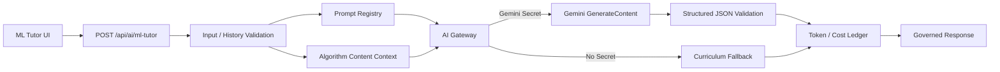

# AI Gateway｜中央 AI 治理架構

## 中文摘要

- 所有正式 AI 呼叫必須經由中央 Gateway，不允許前端直接持有 API Key。
- Prompt 的正式來源為 `prompt_registry/prompts.json`，每次呼叫必須記錄 Prompt ID 與 Version。
- ML Top 10 助教未設定 `GEMINI_API_KEY` 時自動使用教材 fallback，不影響核心學習流程。
- Live 回覆強制使用 JSON Schema，並在伺服器端再次驗證必要欄位。
- Token 使用量取自 Gemini `usageMetadata`；成本只使用營運者自行設定的費率估算，不硬編碼供應商價格。
- 正式環境應把使用紀錄寫入 PostgreSQL；本機可選擇 JSONL。

## 正式流程



## Prompt Registry

目前正式 Prompt：

```text
Prompt ID: ml-algorithm-tutor
Active Version: 1.0.0
Provider: gemini
Default Model: gemini-2.5-flash
```

Registry 欄位：

- Prompt ID
- Prompt 名稱
- Active Version
- Provider
- Model
- Temperature
- Max Output Tokens
- System Prompt
- Response Schema
- Input／History Limits
- 狀態與建立日期

## API

### `POST /api/ai/ml-tutor`

Request：

```json
{
  "algorithmSlug": "decision-tree",
  "message": "為什麼樹太深會過度擬合？",
  "history": [
    { "role": "user", "content": "決策樹像什麼？" },
    { "role": "assistant", "content": "像一步步問問題的流程圖。" }
  ]
}
```

Response：

```json
{
  "reply": "...",
  "suggested_questions": ["..."],
  "assistant_state": "speaking",
  "mode": "live",
  "prompt": {
    "id": "ml-algorithm-tutor",
    "version": "1.0.0"
  },
  "model": "...",
  "usage": {
    "promptTokens": 0,
    "candidateTokens": 0,
    "thoughtsTokens": 0,
    "totalTokens": 0
  },
  "cost": {
    "currency": "USD",
    "inputUsdPerMillionTokens": null,
    "outputUsdPerMillionTokens": null,
    "estimatedUsd": null
  },
  "requestId": "uuid"
}
```

## 安全限制

- 不接收或保存 `user_id`。
- 單次訊息最多 1,000 字。
- 最多傳入最近 6 則對話。
- 單則歷史訊息最多 800 字。
- API Key 只由 Server Runtime 讀取。
- 使用紀錄不保存完整提問與回答內容。
- 供應商錯誤、Timeout、格式錯誤或未設定 Secret 時使用固定教材 fallback。
- 回覆 Schema 再由程式驗證，避免直接信任模型輸出。

## Token 與成本

Token 欄位：

- Prompt Tokens
- Candidate Tokens
- Thoughts Tokens
- Total Tokens

費率環境變數：

```text
AI_GEMINI_INPUT_USD_PER_1M
AI_GEMINI_OUTPUT_USD_PER_1M
```

未設定費率時：

- Token 正常記錄。
- `estimatedUsd` 回傳 `null`。
- 不以過期或猜測價格計算成本。

## 儲存策略

### 本機開發

設定：

```text
AI_USAGE_LOG_PATH=ai_usage_logs/runtime.jsonl
```

每一行為一筆不含對話內容的 JSON Ledger。

### 正式環境

使用 Prisma 預留資料表：

- `ai_prompts`
- `ai_prompt_versions`
- `ai_model_rates`
- `ai_usage_logs`

本輪只更新 Schema，尚未執行 Migration。

## 目前限制

- 尚未執行 Live Gemini API 驗收。
- 尚未執行 Prisma Migration。
- 尚未建立 Prompt 管理後台。
- 尚未建立 Token／成本儀表板。
- Serverless 環境不可依賴本機 JSONL 永久保存。

## 退役關係

當以下條件完成後，ML Top 10 才能停止舊 FastAPI AI 助教：

1. 新 Gateway Live／Fallback 驗收完成。
2. Prompt Registry 正式來源確認。
3. Token／Cost Ledger 能保存與查詢。
4. 新站 AI Tutor UI 驗收完成。
5. 舊 Vercel／FastAPI 導向新平台。
6. 使用者核准退役。
