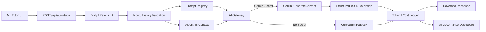

# AI Gateway｜中央 AI 治理架構

## 中文摘要

- 所有正式 AI 呼叫必須經由中央 Gateway，不允許前端直接持有 API Key。
- Prompt 的正式來源為 `prompt_registry/prompts.json`，每次呼叫記錄 Prompt ID 與 Version。
- 未設定 `GEMINI_API_KEY` 時自動使用教材 fallback，不影響核心學習流程。
- Live 回覆要求 JSON Schema，並在伺服器端再次驗證必要欄位。
- Token 使用量對應 Gemini `usageMetadata`；成本只使用營運者自行設定的費率估算。
- `/ai-governance` 提供不公開 Secret 與 Prompt 本文的唯讀治理儀表板。
- 正式環境應把使用紀錄寫入 PostgreSQL；本機可選擇 JSONL。

## 正式流程



## Prompt Registry

```text
Prompt ID: ml-algorithm-tutor
Active Version: 1.1.0
Previous Version: 1.0.0
Provider: gemini
Default Model: gemini-2.5-flash
```

- `1.0.0`：初始繁體中文白話助教。
- `1.1.0`：新增 Prompt Injection、角色改寫、提示語／Secret 揭露與外部動作拒絕規則。
- 舊版本保留，不直接覆寫。

Registry 欄位：Prompt ID、名稱、Active Version、Provider、Model、Temperature、Max Output Tokens、System Prompt、Response Schema、Input／History Limits、狀態與建立日期。

## API

### `POST /api/ai/ml-tutor`

Request：

```json
{
  "algorithmSlug": "decision-tree",
  "message": "為什麼樹太深會過度擬合？",
  "history": [
    { "role": "user", "content": "決策樹像什麼？" },
    { "role": "assistant", "content": "像一步步問問題的流程圖。" }
  ]
}
```

Response：

```json
{
  "reply": "...",
  "suggested_questions": ["..."],
  "assistant_state": "speaking",
  "mode": "live",
  "prompt": { "id": "ml-algorithm-tutor", "version": "1.1.0" },
  "model": "...",
  "usage": {
    "promptTokens": 0,
    "candidateTokens": 0,
    "thoughtsTokens": 0,
    "totalTokens": 0
  },
  "cost": {
    "currency": "USD",
    "inputUsdPerMillionTokens": null,
    "outputUsdPerMillionTokens": null,
    "estimatedUsd": null
  },
  "requestId": "uuid"
}
```

## 安全限制

- 不接收或保存 `user_id`。
- 單次訊息最多 1,000 字。
- 最多傳入最近 6 則對話，每則最多 800 字。
- Request Body 上限 16 KB。
- 預設每匿名來源 10 分鐘最多 10 次請求。
- 匿名識別只保留 SHA-256 截短值，不保存原始 IP。
- API Key 只由 Server Runtime 讀取。
- 使用紀錄不保存完整提問與回答內容。
- Provider 錯誤、Timeout、格式錯誤或未設定 Secret 時使用教材 fallback。
- 回覆 Schema 再由程式驗證，避免直接信任模型輸出。
- 多實例正式環境需把 in-memory Rate Limiter 改為 Redis／資料庫型方案。

## Token 與成本

Token 欄位：Prompt Tokens、Candidate Tokens、Thoughts Tokens、Total Tokens。

費率環境變數：

```text
AI_GEMINI_INPUT_USD_PER_1M
AI_GEMINI_OUTPUT_USD_PER_1M
```

未設定費率時仍記錄 Token，但 `estimatedUsd` 為 `null`，不以過期或猜測價格估算。

## 儲存策略

### 本機開發

```text
AI_USAGE_LOG_PATH=ai_usage_logs/runtime.jsonl
```

每一行為一筆不含對話內容的 JSON Ledger。

### 正式環境

Prisma 預留資料表：

- `ai_prompts`
- `ai_prompt_versions`
- `ai_model_rates`
- `ai_usage_logs`

本輪只更新 Schema，尚未執行 Migration。

## 唯讀治理儀表板

路徑：`/ai-governance`

顯示：

- Gemini Secret 是否已配置（只顯示布林值）
- Prompt ID、Active Version 與歷史版本
- Provider／Model／Temperature／Max Output
- Rate Limit 設定
- Token 費率是否已設定
- Ledger 模式與近期使用紀錄
- PostgreSQL Schema／Migration 狀態

不顯示：

- API Key／Secret
- System Prompt 本文
- 完整提問或回答
- 原始 IP

目前為唯讀頁面；可編輯 Prompt 的權限後台尚未建立。

## 目前限制

- 尚未執行 Live Gemini API 驗收。
- 尚未執行 Prisma Migration。
- 尚未建立可編輯 Prompt 管理後台。
- 尚未建立正式 PostgreSQL Token／成本查詢。
- Serverless 環境不可依賴本機 JSONL 永久保存。

## 退役關係

ML Top 10 停止舊 FastAPI AI 助教前必須完成：

1. 新 Gateway Live／Fallback 驗收。
2. Prompt Registry 正式來源確認。
3. Token／Cost Ledger 能在正式資料庫保存與查詢。
4. 新站 AI Tutor UI／治理儀表板驗收。
5. 舊 Vercel／FastAPI 導向新平台。
6. 使用者核准退役。
