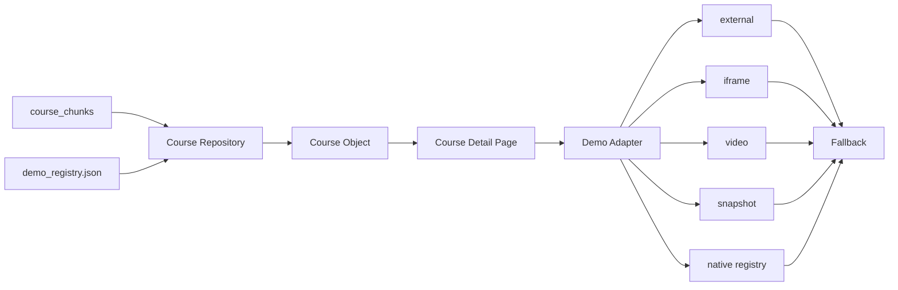

# Demo Adapter 架構說明

## 中文摘要

- 所有作品展示統一由 `DemoAdapter` 處理。
- 課程內容與 Demo 設定分離，避免修改展示網址時重寫大型課程 chunk。
- 支援 `external`、`iframe`、`video`、`snapshot`、`native` 五種模式。
- 外部服務失效、拒絕嵌入或素材未設定時，必須保留可操作的備援連結。

## 1. 主要檔案

```text
course_demo_registry/demo_registry.json
src/components/demo-adapter.tsx
src/components/native-demos/
src/lib/course-repository.ts
src/types/course.ts
```

## 2. 資料流



## 3. Demo 設定格式

```json
{
  "course-slug": {
    "mode": "iframe",
    "title": "作品名稱",
    "description": "展示說明",
    "url": "https://example.com/demo",
    "fallbackUrl": "https://github.com/owner/repo"
  }
}
```

### 欄位

| 欄位 | 必填 | 說明 |
|---|---:|---|
| `mode` | 是 | 展示模式 |
| `title` | 否 | Demo 標題 |
| `description` | 否 | Demo 說明 |
| `url` | 依模式 | iframe、video、snapshot、external 的素材網址 |
| `fallbackUrl` | 建議 | 無法展示時的備援網址 |
| `posterUrl` | 否 | video 封面 |
| `nativeKey` | native 必填 | 站內互動元件註冊鍵值 |

## 4. 模式選擇原則

### external

適合：

- 不允許 iframe 的網站
- 命令列工具或 GitHub Repository
- 尚未轉製的既有作品

### iframe

適合：

- Streamlit、Vercel、GitHub Pages 等可嵌入網站
- 希望學習者不離開課程頁操作

注意：外部服務可能透過 `X-Frame-Options` 或 CSP 拒絕嵌入，因此頁面必須同步提供新分頁連結。

### video

適合：

- Manim 動畫
- 操作錄影
- 無法即時執行的高成本模型

### snapshot

適合：

- 舊系統已無法部署
- 生成式 AI 輸出範例
- 僅需展示畫面與成果

### native

適合：

- 可用純前端重製的互動概念
- 需要穩定、免外部服務的核心教學
- 需要與課程進度、測驗深度整合

## 5. Native Demo 註冊規則

目前以 `nativeKey` 對應 React 元件：

```text
linear-regression-playground
  -> LinearRegressionPlayground
```

新增站內 Demo 時：

1. 在 `src/components/native-demos/` 建立元件。
2. 在 `NativeDemo` 分派器註冊 `nativeKey`。
3. 在 `demo_registry.json` 設定課程 slug。
4. 必須設定 `fallbackUrl`。

## 6. 備援原則

Demo 失效時不得讓整個課程頁崩潰。

優先順序：

1. `demo.fallbackUrl`
2. `source.demoUrl`
3. `source.repositoryUrl`

下列情況應顯示備援卡片：

- `url` 未設定
- 圖片或影片載入失敗
- `nativeKey` 未註冊
- 模式無法辨識
- 外部服務休眠或失效

## 7. 已設定案例

| 課程 | 模式 | 狀態 |
|---|---|---|
| 線性迴歸 | native | 已發布、可用 |
| SVM Kernel Trick | iframe | 已發布、外部服務依賴 |
| CWA OpenData | external | 已發布、可用 |
| 新創利潤預測 | iframe | 待轉製 |
| 電影資料工作台 | external | 待轉製 |
| AI 圖文故事播放器 | iframe | 待轉製 |
| 台股技術分析動畫 | video | 待補影片 |
| Cosmos 文字生成圖片 | snapshot | 待補快照 |

## 8. 本階段限制

依目前專案決策，本階段未執行：

- iframe 實際跨網域驗證
- 影片與圖片素材連線測試
- 瀏覽器相容性測試
- 自動化測試與 CI

以上項目保留至正式驗收階段。
