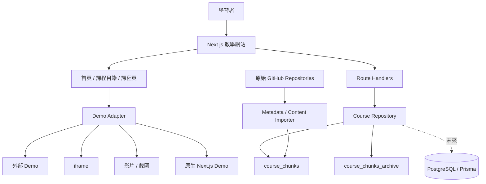

# AI Learning Portfolio｜平台架構

## 中文摘要

- 架構來源：`gshan1209-cell/scrape`。
- 前台採 Next.js App Router；資料先以 JSON chunks 管理。
- Route Handlers 統一提供搜尋、分類與分頁。
- Prisma／PostgreSQL 作為正式資料層預留。
- 原始作業透過來源資訊與 Demo Adapter 接入，不直接混合 runtime。

## 架構圖



## 目錄

```text
AI-Learning-Portfolio/
├── course_chunks/
├── course_chunks_archive/
├── imported_chunks/
├── prisma/
│   └── schema.prisma
├── scripts/
│   └── build_course_manifest.mjs
├── src/
│   ├── app/
│   │   ├── api/courses/
│   │   ├── courses/[slug]/
│   │   └── page.tsx
│   ├── components/
│   ├── lib/
│   └── types/
├── AGENT.md
└── DEVELOPMENT_RECORD.md
```

## 演進順序

1. JSON chunks 作為唯一正式來源。
2. 建立匯入腳本與 `CourseImportFile` 紀錄。
3. PostgreSQL 成為查詢來源，chunks 保留為可追溯原始檔。
4. 加入後台草稿、審核、發布與版本管理。
5. 加入會員、學習進度與 AI 助教。
