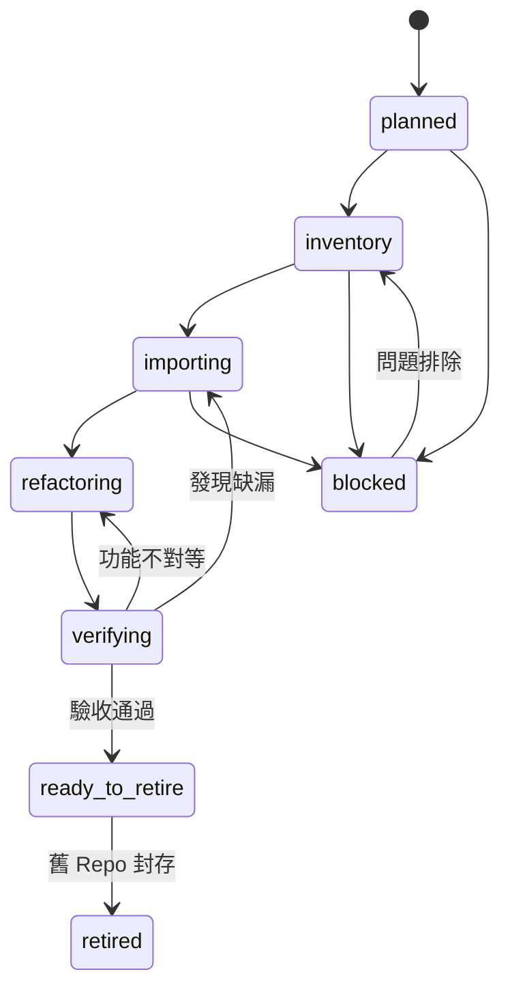

# Source Repository Migration｜來源 Repo 移植與退役規範

## 0. 文件資訊

- 文件版本：v1.0
- 建立日期：2026-07-15
- 適用專案：AI Learning Portfolio
- 適用對象：ChatGPT、Codex、Gemini、Antigravity、OpenCode 與人類維護者

## 1. 核心決策

AI Learning Portfolio 不是外部 Repo 導覽網站，而是所有課程作業的正式接管平台。

來源 Repo 在移植期間仍存在，但最終正式程式、教材、Demo 與文件必須由本專案提供。來源 Repo 完成驗收後應停止開發、加入搬遷公告並設為 Archived／唯讀。

## 2. 不屬於完成移植的情況

以下任一成果都不能單獨宣稱移植完成：

- 課程頁只有摘要與來源連結。
- Demo 使用來源 Repo 的既有網址。
- 以 iframe 嵌入舊 Streamlit／Vercel／GitHub Pages。
- 只保存畫面截圖或操作影片。
- 只把 README 內容複製進新平台。
- 新平台缺少來源 Repo 的核心商業邏輯或演算法。

## 3. 目標 Monorepo 結構

```text
AI-Learning-Portfolio/
├─ src/                              Next.js 平台
│  ├─ app/
│  ├─ components/
│  └─ lib/
├─ modules/                          正式接管的課程模組
│  └─ <module-slug>/
│     ├─ README.md
│     ├─ migration.json
│     ├─ original/                   必要時保存原始版
│     ├─ python-streamlit/           Python／Streamlit 服務
│     ├─ python-cli/                 CLI 工具
│     ├─ django/                     Django 模組
│     ├─ fastapi/                    FastAPI 模組
│     ├─ assets/                     經篩選的必要素材
│     └─ docs/
├─ course_chunks/                    統一課程內容
├─ course_demo_registry/             新平台展示設定
├─ repository_registry/              GitHub Metadata
├─ migration_registry/               移植與退役狀態
└─ docs/migrations/                   規範與逐 Repo 紀錄
```

## 4. 移植狀態機



狀態說明：

| 狀態 | 說明 |
|---|---|
| planned | 已列入清單，尚未盤點 |
| inventory | 盤點入口、相依、資料、素材與部署 |
| importing | 把必要程式與素材移入本專案 |
| refactoring | 改寫為共用模組、native Demo 或 Monorepo service |
| verifying | 比對舊新功能並執行最低必要驗收 |
| ready_to_retire | 已符合退役門檻，但尚未封存來源 Repo |
| retired | 來源 Repo 已唯讀／Archived |
| blocked | 受到授權、技術、體積、資料或環境限制 |

## 5. 每個模組必備文件

### 5.1 `README.md`

至少包含：

- 來源 Repo 與分支
- 原始入口檔
- 原始技術棧
- 新平台模組位置
- 啟動方式
- 已移植功能
- 待補功能
- 退役條件

### 5.2 `migration.json`

至少包含：

- 來源 Repo
- 來源 branch
- 來源 commit／blob SHA
- 已移植檔案
- 排除檔案及原因
- 舊新功能對照
- 驗收狀態
- 搬遷公告狀態
- 舊部署狀態
- Repo 封存狀態

## 6. 來源資產分類

### 必須移植

- 核心程式碼
- 入口檔
- 必要設定範例
- requirements／package manifest
- 教學說明與關鍵圖表
- 使 Demo 成立的必要小型資料

### 條件式移植

- 大型 CSV、模型、影音、圖片
- 生成結果
- 第三方資料快照
- Notebook
- 部署腳本

條件式資產必須評估：

- 授權
- 檔案大小
- 是否能重新生成
- 是否含個資或秘密
- Git LFS／物件儲存需求

### 禁止移植

- API Key
- Token
- 密碼
- `.env`
- 私鑰與憑證
- 未授權資料
- 快取與建置產物
- `.venv`、`node_modules`、`.next`

## 7. 技術移植策略

### Next.js／React 來源

優先合併成：

- `src/components/modules/<module>/`
- `src/app/courses/<slug>/`
- Route Handlers
- 共用資料層

### Streamlit 來源

分兩階段：

1. 將原始版保存到 `modules/<module>/python-streamlit/`。
2. 把核心演算法與互動 UI 改寫成 Next.js native；若不適合改寫，則改由本 Monorepo 管理 Python service。

### FastAPI／Django 來源

- 先完整移入 `modules/<module>/fastapi` 或 `django`。
- 統一環境變數與啟動方式。
- 判斷保留服務或改為 Next.js Route Handler。
- 不得長期依賴舊 Repo 的獨立部署。

### Manim／影片來源

- 產製程式必須移植。
- 影片可保存於物件儲存或平台可控位置。
- `video` 可以是正式展示，但不能只搬影片而遺失產製程式。

## 8. 功能對照與驗收

每個模組建立下表：

| 舊功能 | 新位置 | 狀態 | 差異 | 是否阻擋退役 |
|---|---|---|---|---|
| 功能名稱 | 新元件／服務 | pending／partial／implemented | 說明 | 是／否 |

最低必要驗收：

1. 核心入口存在。
2. 相依套件有紀錄。
3. 無敏感資料。
4. 核心演算法或商業邏輯已移植。
5. 新平台有可操作成果。
6. 主要功能差異已揭露。
7. 啟動與回退方式可理解。

## 9. Repo 退役流程

退役不等於刪除。

建議順序：

1. 新平台模組完成驗收。
2. `migration.json.retirement.ready = true`。
3. 舊 Repo README 首頁加入搬遷公告。
4. 舊 Repo Description 加入 `Moved to AI-Learning-Portfolio`。
5. 舊部署頁顯示搬遷位置或停止服務。
6. 確認沒有其他專案依賴舊 Repo。
7. 將舊 Repo 設為 Archived。
8. Registry 狀態改為 `retired`。

除非使用者另行明確授權，禁止刪除來源 Repository。

## 10. 第一批順序

建議依複雜度由低到高：

1. L4｜線性迴歸
2. cwa_scraper｜政府資料 API
3. L13_SVM｜SVM Kernel Trick
4. L12｜Manim 台股動畫
5. hw07｜特徵選擇
6. hw3-cosmos-text2image｜文字生成圖片
7. 2026-DjangoBlog｜Django Blog
8. machinelearningHw6-2｜新創利潤預測
9. machinelearningHw6｜CRISP-DM
10. scrape_movie｜電影資料工作台
11. scrape_weather｜農事天氣儀表板
12. L20-Ensemble-Model｜Ensemble 模型
13. L2DOC1-github｜AI 圖文故事
14. machinelearningHw05｜十大演算法平台

## 11. 當前執行任務

### ALP-MIG-001｜L4

已完成：

- README、`app.py`、`requirements.txt` 盤點
- 原始 `app.py` 移入新 Repo
- Python requirements 移入新 Repo
- 模組 README
- `migration.json`
- 全域 Migration Registry

待完成：

- Native Playground 隨機資料
- OLS 自動擬合
- Top K Outliers
- 指標卡與資料表
- 最低必要驗收
- 舊 Repo 搬遷公告
- 舊 Repo Archived

## 12. 給開發工具的下一步提示語

```text
請在 gshan1209-cell/AI-Learning-Portfolio 的 feat/platform-foundation 分支執行 ALP-MIG-001。
開始前閱讀 AGENT.md、DEVELOPMENT_RECORD.md、docs/migrations/SOURCE_REPOSITORY_MIGRATION.md 與 modules/linear-regression/migration.json。
以 modules/linear-regression/python-streamlit/app.py 為功能基準，補強 src/components/native-demos/linear-regression-playground.tsx：
1. 支援可重現的隨機資料生成。
2. 實作一元線性迴歸 OLS 自動擬合。
3. 顯示 true slope/intercept、estimated slope/intercept 與 variance。
4. 計算 residual、abs residual。
5. 支援 Top K Outliers 排序、圖上標記與表格。
6. 保留目前 React SVG 顯示方式，不新增重量級圖表套件。
7. 更新 migration.json 的 featureMapping 與 verification。
8. 更新 DEVELOPMENT_RECORD.md。
本階段不封存 L4 Repo，除非 native 功能完成並經人工驗收。
```
