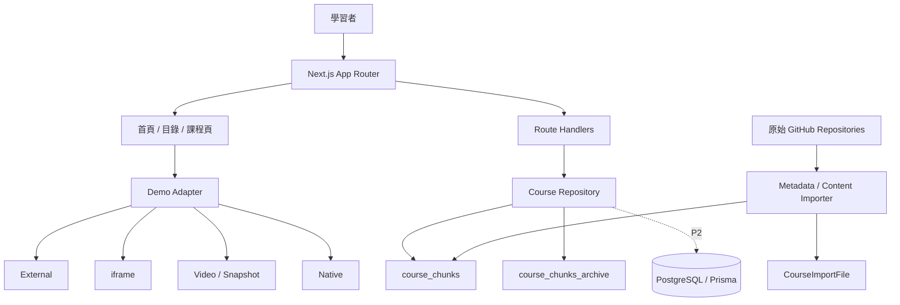
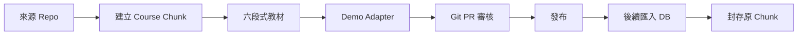

# AI Learning Portfolio｜AI 學習作品集與教學網站 - 開發規格書

> v1.1 架構修訂：改採 `gshan1209-cell/scrape` 的技術架構理念，並使用全新獨立 Repository `gshan1209-cell/AI-Learning-Portfolio`。

## 中文重點摘要

- 將分散於多個 GitHub Repository 的課程作業，整合為個人作品集與新手教學網站。
- 原始 Repo 保留，不搬移 Git 歷史；中央網站保存來源、教學內容、Demo 與版本勾稽。
- 技術架構：Next.js 14 App Router、TypeScript、Tailwind、Route Handlers、JSON chunks、Prisma、PostgreSQL。
- 每門課固定採六段式模板：用途、白話原理、Demo、程式解析、測驗、延伸挑戰。
- P0 已先建立 14 個來源作業登錄與 3 門完整示範課。
- 依專案決策，本階段先跳過正式測試、CI 與部署驗證。

## 0. 文件資訊

- 文件版本：v1.1
- 產生日期：2026-07-15
- 專案定位：教學型作品集與跨 Repo 課程整合平台
- 建議版本：進階版
- 適用工具：Gemini、Codex、Antigravity、OpenCode
- 技術架構參考：`gshan1209-cell/scrape`
- 開發 Repository：`gshan1209-cell/AI-Learning-Portfolio`
- 開發分支：`feat/platform-foundation`

## 1. 專案分類資訊

- 主分類代碼：21
- 主分類名稱：教育學習平台
- 主大類別代碼：G08
- 主大類別名稱：平台服務類
- 次分類：09、13、16、18、19、24
- 複雜度：高
- 建議版本：進階版
- Workflow Key：`21-ai-learning-portfolio-v1.1-C8A7F1`
- Skill Key：`SK21-C8A7`
- Employee Key：`EP21-C8A7`

## 2. 專案摘要

### 一句話說明

把散落的課程作業變成新手也看得懂、能親手操作、能追溯原始碼的 AI 與資料科學作品博物館。

### 目標使用者

- AI、機器學習與 Web 開發新手
- 老師、同學、評審與面試官
- 合作夥伴、客戶與未來維護者
- Codex、Gemini 等開發 Agent

### 核心價值

- 看得懂：白話、生活比喻與圖解。
- 玩得到：外部或原生 Demo。
- 查得到：搜尋、分類與技術標籤。
- 驗得出：來源 Repo、Demo URL 與版本資訊。
- 持續長大：新增課程不需修改核心頁面。

## 3. 產銷人發財分析

- 產：將作業轉為結構化課程資料與共用頁面。
- 銷：作為履歷、GitHub 首頁、比賽與提案入口。
- 人：學習者、內容編輯者、管理者與 Agent 協作。
- 發：由 Course Registry、Demo Adapter 與 Git PR 漸進擴充。
- 財：初期建立品牌與合作價值，後續可延伸顧問、內訓與教材授權。

## 4. 需求範圍

### 4.1 MVP

- 首頁、課程目錄、課程詳情。
- 至少 8 門完整六段式課程。
- 搜尋、分類、原始 Repo 與 Demo 入口。
- JSON chunks 資料來源。
- 本機收藏與學習進度。

### 4.2 進階版

- 完成 14 個已盤點作業的課程化整合。
- 學習路線、測驗、Demo Adapter、來源版本與健康狀態。
- Prisma/PostgreSQL 匯入流程。
- Git-based 內容審核與 AI 助教。

### 4.3 商用版

- 會員、跨裝置進度、完整 CMS、RAG、付費課程、多租戶與權限。

### 4.4 不包含

- 不刪除原始 Repository。
- 不在 Vercel 執行長時間模型訓練或 Manim 渲染。
- 不公開 API Key、資料庫密碼、私有程式或受限資料。

### 4.5 假設與限制

- 外部 Demo 可能有冷啟動、CSP 或服務暫停問題。
- 無法 iframe 時必須使用 external、video 或 snapshot fallback。
- 課程以繁體中文為主，技術名稱保留英文。

## 5. 使用者角色與權限

| 角色 | 權限 |
|---|---|
| 訪客 | 瀏覽公開作品與課程 |
| 學習者 | 收藏、進度、測驗、AI 助教 |
| 內容編輯者 | 維護 Course Chunk 與教材 |
| 管理者 | 發布、版本、來源與分析設定 |
| AI Agent | 依 AGENT.md 開發、更新紀錄與文件 |

P0～P2 內容管理採 Git PR，不先建立後台登入。

## 6. 核心功能模組

### 6.1 作品集首頁

- 目的：30 秒內理解作者、作品與學習路線。
- 功能：Hero、精選課程、技能摘要、進度數據。
- 驗收：手機無水平捲動，能直接進入課程目錄。

### 6.2 課程目錄

- 功能：關鍵字、分類、難度、狀態與分頁。
- API：`GET /api/courses`。
- 驗收：可搜尋標題、摘要、技術與來源 Repo。

### 6.3 六段式課程頁

1. 能做什麼。
2. 白話原理與生活比喻。
3. Demo 與觀察重點。
4. 程式架構與關鍵程式碼。
5. 小測驗與解析。
6. 延伸挑戰。

### 6.4 Demo Adapter

- `external`：新分頁。
- `iframe`：允許嵌入的外部站。
- `video`：操作影片。
- `snapshot`：截圖與步驟。
- `native`：Next.js 原生互動元件。
- 所有模式都必須有 fallback。

### 6.5 學習進度

- P1 使用 localStorage。
- 商用版使用 `CourseProgress` 資料表。

### 6.6 原始碼證據鏈

每門課保存 `repository`、`repositoryUrl`、`demoUrl`、來源 Commit 與最後同步時間。

## 7. 前台頁面規格

| 路由 | 說明 |
|---|---|
| `/` | 作品集首頁與精選課程 |
| `/courses` | 搜尋、分類與完整目錄 |
| `/courses/[slug]` | 六段式教學頁 |
| `/api/courses` | 課程搜尋與分頁 API |
| `/api/courses/[slug]` | 單一課程 API |
| `/paths` | 後續學習路線 |
| `/progress` | 後續學習進度 |
| `/about` | 後續個人背景與技術歷程 |

## 8. 後台管理規格

P0 使用 Git-based CMS：

- `course_chunks/`：新增與現行課程。
- `course_chunks_archive/`：歷史與封存課程。
- `imported_chunks/`：已匯入 PostgreSQL 的來源檔。
- 狀態：`planned`、`draft`、`published`、`deprecated`。
- AI 產生教材預設只能是 draft，經 PR 審核後發布。

## 9. AI 功能規格

- 場景：課程解釋、錯題補充、下一課建議與教材草稿。
- Prompt：先給結論，再以白話與例子說明；不確定時明確說明。
- RAG：以 H2/H3 切分，保存 course、section、source URL。
- 信心：high、medium、low。
- 人工接手：AI 教材不得直接發布。
- 成本：Prompt Version、Token、模型、延遲與估算成本記錄。

## 10. 第三方整合規格

| 整合 | 用途 | 注意事項 |
|---|---|---|
| GitHub | 原始碼、來源與版本 | Rate limit、私有內容 |
| Vercel | 中央網站 | 不執行長時間工作 |
| Streamlit | 既有 ML Demo | 冷啟動與嵌入限制 |
| Gemini | AI 助教 | Key、成本與版本 |
| CWA OpenData | API 教學 | Key 與格式變動 |
| OSM / Leaflet | 地圖案例 | Attribution |

## 11. 系統架構



### 專案結構

```text
AI-Learning-Portfolio/
├── course_chunks/
├── course_chunks_archive/
├── imported_chunks/
├── prisma/schema.prisma
├── scripts/
├── src/app/
├── src/components/
├── src/lib/
├── src/types/
├── docs/
├── AGENT.md
└── DEVELOPMENT_RECORD.md
```

## 12. 資料庫設計

已建立 Prisma Schema：

- `Course`：課程主資料、狀態、標籤、測驗。
- `CourseSource`：來源 Repo、Demo 與 Commit。
- `CourseSection`：六段式章節與排序。
- `CourseProgress`：學習狀態與分數。
- `CourseImportFile`：Chunk 匯入紀錄、雜湊與錯誤。

## 13. API 規格草案

### `GET /api/courses`

Query：`q`、`category`、`level`、`status`、`page`、`limit`。

Response：

```json
{
  "items": [],
  "pagination": {
    "page": 1,
    "limit": 12,
    "total": 14,
    "totalPages": 2
  }
}
```

### `GET /api/courses/{slug}`

- 200：回傳完整課程。
- 404：`Course not found`。

## 14. 主要流程圖



## 15. 非功能需求

- 效能：前端不直接匯入大型 JSON；伺服器端查詢與分頁。
- 可用性：外部 Demo 失效不得造成整頁白屏。
- 安全：Secret 僅存在伺服器環境，iframe 使用 allowlist。
- 維護性：TypeScript strict；新增課程不改核心頁面。
- SEO：每門課獨立 Metadata、OG、Canonical 與 Sitemap。
- 無障礙：鍵盤操作、alt、基本 WCAG AA。

## 16. 報價與時程建議

以下為估算級距，不是正式報價：

- P0 架構與 Registry：1～2 週，NT$50,000～100,000。
- P1 教學體驗與 Demo Adapter：2～4 週，NT$100,000～220,000。
- P2 內容轉製與 DB 匯入：3～6 週，NT$120,000～300,000。
- P3 進度、測驗與 AI 助教：2～4 週，NT$80,000～220,000。
- 進階版總估算：NT$250,000～650,000。

## 17. 測試計畫

依使用者決策，本階段先跳過正式測試、CI 與部署驗證。

後續補做項目：

- Course Schema 與 Chunk 驗證。
- API 搜尋、篩選與分頁。
- 動態課程頁與 404。
- Demo Adapter fallback。
- `npm run lint`、型別檢查與 build。
- E2E、效能、無障礙與外部連結健康檢查。

## 18. 驗收標準

### P0

- [x] 全新獨立 Repository。
- [x] Next.js／Tailwind 骨架。
- [x] JSON chunk Repository。
- [x] 課程列表與單課程 API。
- [x] 首頁、目錄與動態課程頁。
- [x] 14 個來源作業登錄。
- [x] 3 門六段式示範課。
- [x] Prisma Schema。
- [ ] 正式測試與部署驗證，依決策延後。

## 19. 開發任務拆解

### P0｜已完成基礎

- `ALP-P0-001` Course Type 與 Registry。
- `ALP-P0-002` JSON chunks Repository。
- `ALP-P0-003` 首頁、目錄與課程頁。
- `ALP-P0-004` 課程 API。
- `ALP-P0-005` Prisma Schema 與文件。

### P1｜下一階段

- `ALP-P1-001` Demo Adapter 五種模式。
- `ALP-P1-002` GitHub Metadata 同步。
- `ALP-P1-003` PostgreSQL 匯入與封存腳本。
- `ALP-P1-004` localStorage 進度與收藏。
- `ALP-P1-005` 學習路線。

### P2｜內容轉製

依序處理十大演算法、CRISP-DM、新創利潤、Manim、特徵選擇、Cosmos、電影爬蟲、天氣儀表板、Django、Ensemble 與圖文故事。

## 20. 給開發工具的實作提示語

你正在 `gshan1209-cell/AI-Learning-Portfolio` 開發教學型作品集。

開始前閱讀：

1. `AGENT.md`
2. `DEVELOPMENT_RECORD.md`
3. `docs/specs/AI_Learning_Portfolio_SPEC_v1_1.md`
4. `docs/architecture/PLATFORM_ARCHITECTURE.md`

核心規則：

- 採用 Next.js 14、TypeScript、Tailwind、Route Handlers、JSON chunks 與 Prisma。
- 不把功能塞回 `scrape` 或 `machinelearningHw05`。
- 原始 Repository 全部保留。
- 每門課必須有六段式內容與來源證據。
- 新增課程先建立新 chunk，不修改核心頁面。
- Demo 使用 Adapter，且一定有 fallback。
- 不提交任何 API Key、Token 或密碼。
- 本階段不阻塞於正式測試，但必須在開發紀錄列出未驗證項目。

### 給 Codex 的下一步

實作 `ALP-P1-001`：建立 `external`、`iframe`、`video`、`snapshot`、`native` 五種 Demo Adapter 與一致的錯誤 fallback。完成後更新 `DEVELOPMENT_RECORD.md`，不要進行正式部署。
