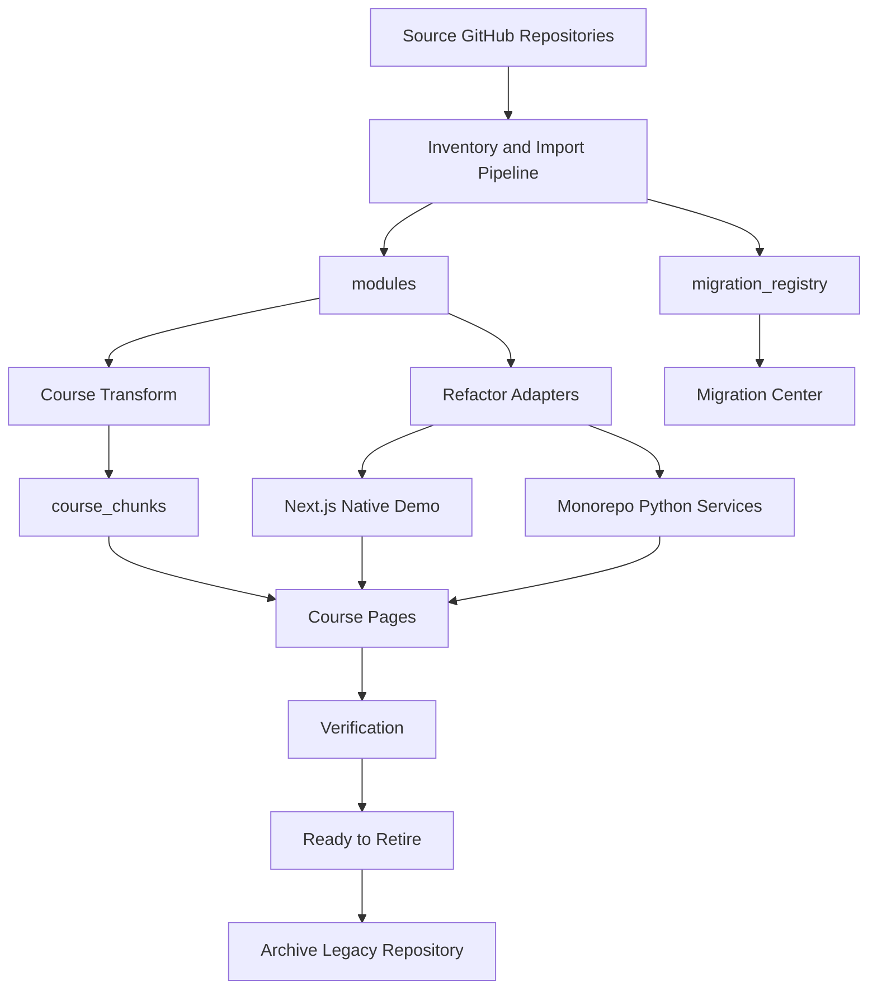
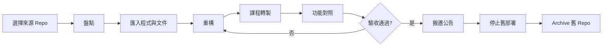

# AI Learning Portfolio - 開發規格書 v1.2｜來源 Repo 移植與退役版

## 0. 文件資訊

- 文件版本：v1.2
- 產生日期：2026-07-15
- 專案定位：將分散的課程 Repository 移植為單一教學型 Monorepo，完成後退役舊 Repo
- 建議版本：進階版，逐步升級商用版
- 適用開發工具：Gemini、Codex、Antigravity、OpenCode
- 取代文件：v1.1「來源連結型作品集」架構

## 1. 專案分類資訊

- 主分類代碼：21
- 主分類名稱：教育學習平台
- 主大類別代碼：G08
- 主大類別名稱：平台服務類
- 次分類：09 形象網站、13 CMS、16 數據分析、19 系統整合、20 資料蒐集
- 複雜度：高
- 建議版本：進階版
- Workflow Key：`21-ai-learning-portfolio-v1.2-MIGR8A`
- Skill Key：`SK21-MIGR`
- Employee Key：`EP21-MIGR`

## 2. 專案摘要

### 一句話說明

把 14 個分散的課程作業 Repo 的程式、教材與 Demo 真正移植到 AI Learning Portfolio，完成驗收後淘汰舊 Repo。

### 專案背景

先前設計偏向中央入口與外部 Repo 導覽，但使用者最終目標是由新專案接管程式碼與功能。外部連結、iframe 與舊部署只允許作為過渡。

### 目標使用者

- 個人作品集訪客
- AI／資料科學初學者
- 教學者
- 維護 AI Learning Portfolio 的 Agent 與開發者

### 核心價值

- 單一正式程式來源
- 統一教學體驗
- 統一技術與資料治理
- 可追蹤的移植與退役流程
- 保留歷史但淘汰分散維護

## 3. 產銷人發財分析

- 產：將舊課程程式重構為可維護模組與 native Demo。
- 銷：作為個人品牌、教學內容、接案與課程展示入口。
- 人：降低多 Repo 維護、啟動、部署與交接成本。
- 發：建立可重複的 Source Migration Pipeline。
- 財：未來可延伸付費課程、會員、企業培訓與技術顧問服務。

## 4. 需求範圍

### 4.1 MVP 版範圍

- 平台首頁與課程頁
- 14 個來源 Repo Registry
- Migration Registry
- 至少 3 個 Repo 完整移植
- 原始碼、依賴、文件與 native Demo
- 來源 Repo 退役門檻

### 4.2 進階版範圍

- 14 個 Repo 全數移植
- 移植管理後台
- 原始檔案樹、commit 與資產快照
- 共用 Demo Runtime
- 課程進度與收藏
- PostgreSQL 資料層

### 4.3 商用版範圍

- 會員與權限
- 多講師／多課程管理
- AI 助教
- 內容審核
- 付費課程
- 成本與使用儀表板
- 完整 CI、備份、稽核與資安

### 4.4 不包含範圍

- 未授權大型資料集
- API Key、Token 與秘密
- 無差別複製 `.venv`、`node_modules`、快取與 build 產物
- 在未驗收前直接刪除或封存來源 Repo

## 5. 使用者角色與權限

| 角色 | 權限 |
|---|---|
| 訪客 | 瀏覽課程與 Demo |
| 學習者 | 收藏、進度、測驗 |
| 編輯者 | 編輯課程與模組說明 |
| 移植管理者 | 更新 Migration Registry、驗收與退役狀態 |
| 系統管理員 | 管理使用者、部署、資料與退役操作 |

## 6. 核心功能模組

### 6.1 Migration Registry

- 目的：追蹤來源 Repo 從 planned 到 retired。
- 功能：狀態、模組路徑、Runtime、退役條件、搬遷公告、舊部署狀態。
- 驗收：14 個來源 Repo 皆有唯一紀錄且可查詢。

### 6.2 Source Import

- 目的：匯入必要原始碼、依賴、素材與說明。
- 功能：來源 SHA、檔案清單、排除清單、授權與敏感資料檢查。
- 驗收：每個模組具有 `README.md` 與 `migration.json`。

### 6.3 Refactor Adapter

- 目的：把不同框架的舊功能轉為平台可維護形式。
- 功能：Next.js native、Monorepo Python service、影片產製、CLI 教學模式。
- 驗收：正式功能不依賴舊 Repo 執行環境。

### 6.4 Feature Parity

- 目的：建立舊新功能對照。
- 功能：pending、partial、implemented、difference、blocking。
- 驗收：所有核心功能均有明確狀態。

### 6.5 Retirement Workflow

- 目的：安全淘汰舊 Repo。
- 功能：搬遷公告、部署停止、Archived、回退資訊。
- 驗收：只有 `ready_to_retire` 可進入 `retired`。

## 7. 前台頁面規格

- `/`：平台定位與移植進度摘要
- `/courses`：課程目錄
- `/courses/[slug]`：教學內容、native Demo、來源與移植狀態
- `/sources`：移植與退役中心
- 未來 `/modules/[slug]`：模組技術文件與原始版啟動說明

## 8. 後台管理規格

未來後台至少包含：

- Repo 清單
- 移植狀態
- 來源檔案盤點
- 功能對照
- 排除檔案
- 驗收紀錄
- 搬遷公告
- 退役核准

## 9. AI 功能規格

### AI 使用場景

- 分析 README 與檔案樹
- 推薦入口檔與技術棧
- 產生六段式課程草稿
- 比對舊新功能缺口
- 產生搬遷公告草稿

### Prompt 邏輯

AI 必須以來源程式與文件為依據，不得把外部連結誤判為移植完成。

### 內容審核

- AI 產出的課程草稿與移植判斷預設需人工審核。
- Repo 封存不得由 AI 自動執行。

### 成本控管

- 優先使用檔案摘要與增量差異。
- 不重複分析未變更檔案。
- 保存來源 SHA 與分析版本。

## 10. 第三方整合規格

- GitHub API：讀取 Metadata、README、commit 與檔案內容
- PostgreSQL：課程、模組、移植紀錄
- Vercel：Next.js 平台
- Python Runtime：Streamlit、FastAPI、Django、Manim 模組
- 物件儲存：大型影片、模型與資產

## 11. 系統架構



## 12. 資料庫設計

### `source_repositories`

- id
- full_name
- default_branch
- visibility
- archived
- source_url
- last_synced_at

### `migration_records`

- id
- source_repository_id
- course_slug
- module_path
- status
- source_runtime
- target_demo_mode
- retirement_ready
- source_readme_redirected
- legacy_deployment_retired
- created_at
- updated_at

### `migration_files`

- id
- migration_id
- source_path
- target_path
- source_sha
- action
- excluded_reason

### `feature_mappings`

- id
- migration_id
- legacy_feature
- target_feature
- status
- difference
- blocks_retirement

### `verification_records`

- id
- migration_id
- verification_type
- result
- evidence
- verified_by
- verified_at

## 13. API 規格草案

```text
GET  /api/migrations
GET  /api/migrations?status=refactoring
GET  /api/migrations?q=streamlit
GET  /api/migrations/{repository}
POST /api/admin/migrations/{id}/inventory
POST /api/admin/migrations/{id}/verify
POST /api/admin/migrations/{id}/ready-to-retire
```

退役 API 必須要求管理員權限與人工確認。

## 14. 主要流程圖



## 15. 非功能需求

- 不提交任何秘密
- 大型資產不得直接無限制進 Git
- 所有移植均可追溯來源 SHA
- 每個舊 Repo 有回退方式
- 前台不得因外部 Repo 下線而失效
- native Demo 應具基本 RWD
- 退役操作必須人工確認

## 16. 報價與時程建議

此處為估算級距，不是正式報價。

### 14 Repo 全量移植

- 時程：14～28 週
- 估算：NT$500,000～1,200,000

影響因素：

- Python／Next.js／Django／FastAPI 混合架構
- 大型模型與影音資產
- 是否要求功能完全等價
- 是否保留獨立 Python service
- 舊部署搬遷與資料庫整合

### 第一階段

- 3 個低至中複雜度 Repo
- 時程：3～6 週
- 估算：NT$120,000～300,000

## 17. 測試計畫

雖然目前完整 CI 暫緩，每個 Repo 退役前仍需：

- 原始入口檔結構檢查
- 相依套件檢查
- 敏感資料掃描
- 核心功能人工驗收
- native Demo 操作驗收
- 舊新功能差異檢查
- 搬遷與回退檢查

## 18. 驗收標準

單一 Repo 移植完成需滿足：

1. 核心原始碼已進 `modules/`。
2. `migration.json` 完整。
3. 核心功能已由新平台或 Monorepo service 提供。
4. 外部 Repo 不再是正式執行依賴。
5. 功能差異已揭露。
6. 必要驗收完成。
7. 搬遷公告完成。
8. 舊 Repo 進入 Archived／唯讀。

## 19. 開發任務拆解

### P0

- [x] 平台骨架
- [x] 課程 Registry
- [x] Demo Adapter
- [x] Repository Metadata

### MIG-001｜L4

- [x] 盤點
- [x] 原始程式匯入
- [x] requirements 匯入
- [x] Native OLS
- [x] Residual 與 Top K Outliers
- [ ] 執行驗收
- [ ] 搬遷公告
- [ ] 舊 Repo Archived

### MIG-002～014

依移植順序逐一執行 inventory、importing、refactoring、verifying、retirement。

## 20. 給開發工具的實作提示語

```text
你正在維護 gshan1209-cell/AI-Learning-Portfolio。
本專案是來源 Repo 的正式接管 Monorepo，不是外部連結型作品集。
開始前閱讀 AGENT.md、DEVELOPMENT_RECORD.md、docs/migrations/SOURCE_REPOSITORY_MIGRATION.md 與 migration_registry/migrations.json。
任何來源 Repo 必須經過 inventory、importing、refactoring、verifying、ready_to_retire、retired。
external 與 iframe 不算完成移植。
不得提交 Token、API Key、密碼、.env、node_modules、.venv 或 build cache。
每次移植都要建立 modules/<slug>/README.md 與 migration.json，保存來源 branch、SHA、匯入檔案、排除理由、功能對照與驗收紀錄。
未經人工驗收與明確授權，不得封存或刪除來源 Repo。
目前優先完成 ALP-MIG-001 L4 的執行驗收，再開始 cwa_scraper。
```
